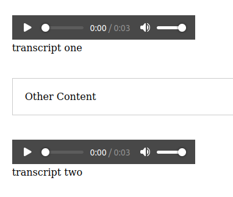
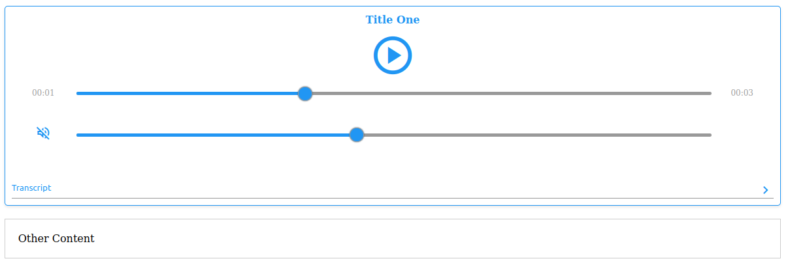
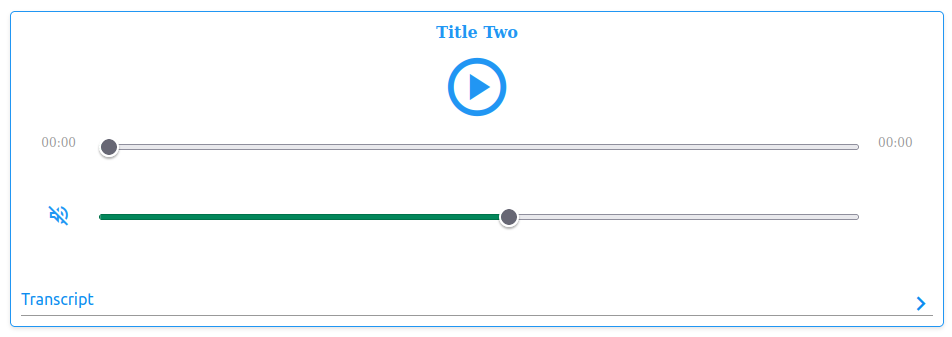

# Vanilla HTML CSS JS audio player component

#### Converts native audio elements to more UX friendly and aesthetically pleasing utilities.

Will convert this


```html
<audio data-title="Title One" controls>
  <source src="audio.wav" type="audio/wav" />
  Your browser does not support the audio element.
</audio>
<div data-transcript>transcript one</div>

<div class="otherContent">Other Content</div>

<audio data-title="Title Two" controls>
  <source src="audio.wav" type="audio/wav" />
  Your browser does not support the audio element.
</audio>
<div data-transcript>transcript two</div>
```

to this:



# Usage

- Include `/src/audio.css` and `/src/audio.js`.
- Add this template element to the `body` tag.
- Add the `data-title` attribute to the `<audio data-title="The title of the audio" />` tag.
- Update the variables in `audio.css` to update change the colors.

## Note

- The transcript element must immediately follow the `<audio />` element and must have the attribute `data-transcript`.

Now all native audio elements will be replaced.

Look at `index.html` for a full example.
