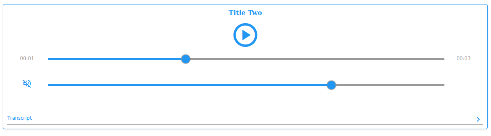

# Vanilla HTML CSS JS audio player component

#### Converts native audio elements to more UX friendly and aesthetically pleasing utilities.

Will convert this


```html
<audio data-title="Title One" controls>
  <source src="audio.wav" type="audio/wav" />
  Your browser does not support the audio element.
</audio>
<div data-transcript>transcript one</div>

<div class="otherContent">Other Content</div>

<audio data-title="Title Two" controls>
  <source src="audio.wav" type="audio/wav" />
  Your browser does not support the audio element.
</audio>
<div data-transcript>transcript two</div>
```

to this:



# Usage

- Include `/src/audio.css` and `/src/audio.js`.
- Include `<link
    href="https://fonts.googleapis.com/css2?family=Material+Symbols+Outlined"
    rel="stylesheet"
  />
`

- Copy this this template element to your `body` tag.

```html
<template id="audio-player-template">
  <div class="audio-player">
    <div class="controls">
      <h4 class="title"></h4>
      <div class="play">
        <button class="btn-icon play-pause-button">
          <span class="material-symbols-outlined">play_circle</span>
        </button>
      </div>

      <div class="controlsGrid">
        <div class="time">
          <span class="current-time">00:00</span>
        </div>
        <div>
          <input
            type="range"
            class="progress-slider"
            min="0"
            max="100"
            step="0.1"
            value="0"
          />
        </div>
        <div class="time">
          <span class="duration">00:00</span>
        </div>

        <div class="mute">
          <button class="btn-icon mute-button">
            <span class="material-symbols-outlined">volume_off</span>
          </button>
        </div>
        <input
          type="range"
          class="volume-slider"
          min="0"
          max="1"
          step="0.01"
          value="1"
        />
        <div></div>
      </div>
    </div>
    <div class="transcriptContainer">
      <button class="showHideTranscriptBtn">
        <span>Transcript</span
        ><span class="material-symbols-outlined">chevron_right</span>
      </button>
      <div class="transcript">Blah blah</div>
    </div>
  </div>
</template>
```

- Add the `data-title` attribute to the `<audio data-title="The title of the audio" />` tag.
- The transcript element must immediately follow the `<audio />` element and must have the attribute `data-transcript`.
- Update the variables in `audio.css` to update change the colors.

Now all native audio elements will be replaced.

Look at `index.html` for a full example.
